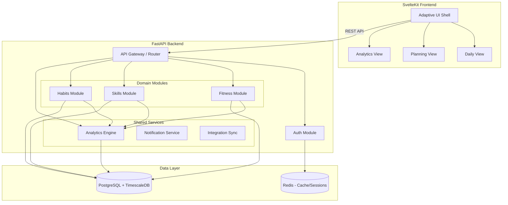
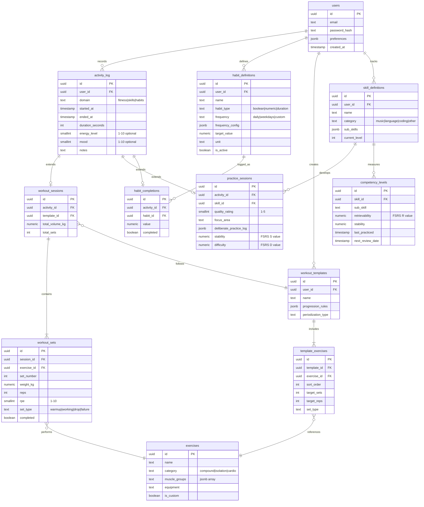
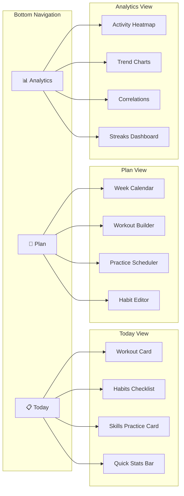

# Building a unified training and habit tracking platform

**A web-first application combining fitness, skills, and habits in a single adaptive interface is technically feasible and fills a genuine gap — no existing app successfully unifies all three domains.** The recommended stack is SvelteKit + FastAPI + PostgreSQL/TimescaleDB, chosen for development velocity, built-in reactivity, and time-series analytics power. This report provides a complete blueprint: architecture, schemas, API design, UI patterns, and a phased roadmap that an intermediate Rust/Python developer can execute incrementally.

---

## 1. Modern tech stack analysis

### Frontend: SvelteKit wins for this project

The developer's experience with both Svelte and React makes this a genuine choice. After analyzing performance data, ecosystem maturity, and project-specific requirements, **SvelteKit with Svelte 5** is the stronger pick for a data-rich, adaptive tracking app built by a solo developer.

| Factor | Svelte 5 / SvelteKit | React 19 / Next.js |
|--------|----------------------|---------------------|
| **Bundle size (gzipped)** | **~1.6 KB** framework overhead | ~42.2 KB framework overhead |
| **Performance** | Lighthouse ~96, 30% faster load times | Lighthouse lower, virtual DOM overhead |
| **Lines of code** | **~40% fewer** than equivalent React | More boilerplate, JSX verbosity |
| **State management** | Built-in Runes (`$state`, `$derived`, `$effect`) | Requires external libs (Zustand, Jotai, TanStack Query) |
| **Developer satisfaction** | **72.8%** admired (highest of any framework) | 62.2% admired |
| **Ecosystem size** | Smaller (6.5% usage), growing 300% YoY | Massive (39.5% usage), most third-party libs |
| **Component libraries** | shadcn-svelte, Skeleton UI, Bits UI | shadcn/ui, Radix, MUI, Chakra — far larger selection |
| **SSR/SSG** | SvelteKit built-in, file-based routing | Next.js, React Server Components |
| **Progressive enhancement** | First-class (`use:enhance` on forms) | Requires manual implementation |

**Why Svelte wins here**: The app needs fast, responsive data entry during workouts (every millisecond of UI lag matters mid-set), compact bundles for gym environments with poor connectivity, and complex reactive state across three domains. Svelte's compiler approach eliminates the virtual DOM overhead, its Runes system means zero external state management dependencies, and **40% less code** means a solo developer ships faster. The ecosystem gap has narrowed substantially — shadcn-svelte now provides a production-quality component library with 7,500+ GitHub stars.

**When React would be better**: If you anticipate hiring other developers soon (React has a 6x larger talent pool), need a specific complex component library that only exists in React, or want maximum third-party integration options.

Vue and SolidJS were also evaluated. Vue offers a middle ground but adds no compelling advantage given existing Svelte/React experience. SolidJS achieves the highest raw benchmarks (Lighthouse ~98) but its ecosystem is too immature for production side projects.

### Backend: FastAPI for shipping, Axum for the long game

| Factor | FastAPI (Python) | Axum (Rust) |
|--------|-----------------|-------------|
| **Time to first endpoint** | Minutes | 10-30 minutes |
| **Development velocity** | **3-5x faster** | Slower (compile times, borrow checker) |
| **Raw performance** | ~2,000 RPS on modest hardware | Orders of magnitude higher at scale |
| **DB query speed** | Baseline | **2.5x faster** (Axum takes 40% of FastAPI's time) |
| **Memory usage** | Significantly higher | Order of magnitude lower |
| **ORM ecosystem** | SQLAlchemy 2.0 + Alembic (battle-tested) | SeaORM 1.0+ or SQLx (younger but capable) |
| **Auth libraries** | Rich (python-jose, passlib, FastAPI-Users) | Functional (axum-login, tower-sessions) |
| **Deployment** | Docker ~100-300 MB, needs runtime | Single binary, Docker <20 MB |
| **Hot reload** | Yes (uvicorn --reload) | Slow recompilation |

**Recommendation: Start with FastAPI, migrate hot paths to Rust later.** For a habit tracking app, the database is the bottleneck, not the web framework. FastAPI achieves **80-90% of practical Rust performance** for typical CRUD apps because I/O latency dominates CPU latency. The 3-5x development velocity advantage is decisive for a side project. Pydantic v2 (which is Rust-powered under the hood) significantly closed the serialization performance gap.

A pragmatic hybrid approach: build the entire app in FastAPI, then use PyO3 to incrementally migrate compute-heavy analytics (correlation calculations, streak computation) to Rust modules.

### Database: PostgreSQL + TimescaleDB is the clear winner

The app stores three types of temporal data — workout logs with nested sets, practice sessions with quality ratings, and habit completion events. This is fundamentally a time-series problem with relational needs.

| Database | Fit for this project | Key tradeoff |
|----------|---------------------|--------------|
| **PostgreSQL + TimescaleDB** | ⭐ **Excellent** | Best of both worlds: relational + time-series |
| **PostgreSQL (vanilla)** | Good for MVP | Performance degrades at scale (insert rate drops from 115K/s to 5K/s at 1B rows) |
| **SQLite** | Prototyping only | Single-writer limitation kills multi-user |
| **SurrealDB** | Not recommended | Community reports significant bugs; "cannot confidently propose for any products" |

TimescaleDB adds hypertables that auto-partition data by time, delivering **20x higher insert rates** at scale, **continuous aggregates** that automatically pre-compute daily/weekly summaries (perfect for dashboard performance), `time_bucket()` for habit heatmaps and trend charts, and **90%+ compression** for historical data. It remains fully PostgreSQL-compatible, working with SQLAlchemy, Alembic, and every standard Postgres tool.

**Migration path**: Start with vanilla PostgreSQL. When analytics queries slow down (likely at 100K+ rows in activity tables), add the TimescaleDB extension and convert activity tables to hypertables with zero application code changes.

### Charting: a layered approach for different visualization needs

| Library | Bundle size | Best for | Svelte support |
|---------|------------|----------|----------------|
| **Apache ECharts** | ~1 MB (tree-shakeable to ~300 KB) | Feature-rich dashboards, **calendar heatmaps**, 40+ chart types | Framework-agnostic, wrappers available |
| **uPlot** | **47.9 KB** | Time-series performance (150K points in 34ms) | Official wrapper via uplot-wrappers |
| **LayerChart** | Lightweight | Svelte-native charts, integrates with shadcn-svelte | **Native Svelte 5** |
| **LayerCake** | Lightweight | Custom/bespoke visualizations | Created for Svelte, SSR-compatible |

**Recommended combination**: Use **LayerChart** (Svelte-native, integrates with shadcn-svelte) as the primary charting solution for standard visualizations. Add **Apache ECharts** for calendar heatmaps and complex analytical views where its 40+ chart types shine. Reserve **uPlot** for performance-critical time-series views where you're plotting thousands of data points.

### State management: Svelte 5 Runes eliminate external dependencies

Svelte 5 Runes provide a unified reactive system that replaces the need for Zustand, Jotai, Redux, or any external state library:

```typescript
// fitness-store.svelte.ts
let workouts = $state<Workout[]>([]);
let todaysWorkout = $derived(workouts.find(w => isToday(w.scheduledDate)));
let weeklyVolume = $derived(
  workouts
    .filter(w => isThisWeek(w.completedDate))
    .reduce((sum, w) => sum + w.totalVolume, 0)
);

// Cross-domain derived state
let dashboardData = $derived({
  fitness: { todaysWorkout, weeklyVolume },
  habits: habitStore.todaysHabits,
  skills: skillStore.todaysPractice,
  streakHealth: computeOverallStreak(habitStore.streaks, workouts)
});
```

For server state synchronization, **TanStack Query** (framework-agnostic, works with Svelte) handles caching, revalidation, and background refetching. SvelteKit's built-in `load` functions handle initial server-side data fetching.

---

## 2. How modern apps solve these problems

### Fitness tracking: the set-logging UX is solved

Strong, Hevy, and TrainHeroic collectively demonstrate the matured patterns for workout tracking:

**During-workout UI**: The universal pattern is a **set table** showing columns for Set Number, Previous Performance (from last session), Weight, Reps, and a completion checkmark. Rest timers auto-start on set completion. This "previous column" pattern is the single most important UX element — it enables progressive overload without any automated system. Both Strong and Hevy use it identically because it works.

**Data model consensus**: The fitness domain has converged on a hierarchy: **Exercise Library → Workout Templates (Routines) → Workout Sessions → Sets**. Sets are the atomic unit, storing weight, reps, and optional metadata (RPE, set type: warm-up/working/drop/failure). TrainHeroic extends this with **prescription vs. actual** — coaches prescribe target sets, athletes log actual performance, enabling compliance tracking.

**Progressive overload**: Consumer apps (Strong, Hevy) leave progression to the user — showing previous performance and PR notifications is sufficient for most lifters. TrainHeroic adds coach-programmed periodization with percentage-based loading (sets at 70% of working max), mesocycle/macrocycle structures, and readiness surveys. **For the unified app, the sweet spot is displaying previous performance prominently plus optional auto-progression rules** (e.g., "if all sets completed at target reps, increase weight by 2.5 kg next session").

**Analytics that matter**: Hevy's muscle group volume distribution charts, exercise-specific 1RM progression, and monthly training reports represent the analytics ceiling for consumer fitness apps. TrainHeroic adds compliance rates and readiness trends. The key insight: **volume over time per exercise** and **estimated 1RM trends** are the two charts users check most.

### Skills training: spaced repetition generalizes beyond flashcards

Duolingo and Anki reveal that **effective skill tracking requires modeling memory, not just logging time**.

**Duolingo's Half-Life Regression (HLR)** models each learned concept as an exponentially decaying memory: p = 2^(−Δ/h), where Δ is time since last practice and h is the concept's half-life. The half-life grows with successful reviews and shrinks with failures. Their Birdbrain AI processes **500M+ lessons daily** to calibrate difficulty. Key insight: streaks alone reduced churn by 21%, and users with 7-day streaks are 3.6x more likely to stay engaged long-term.

**Anki's FSRS algorithm** uses a three-component memory model — Difficulty (D), Stability (S), and Retrievability (R) — with **21 ML-trained parameters** personalized to each user's review history. This achieves **20-30% fewer reviews** than the classic SM-2 algorithm for the same retention level. The model is generalizable: any skill with discrete sub-components (guitar techniques, programming concepts, language patterns) can use D/S/R tracking.

**Practice quality tracking** is the underexplored frontier. Modacity (music practice app) combines timed sessions with subjective **mastery star ratings** and a deliberate practice framework (identify one focus area → try a strategy → evaluate results). Tonara uses AI to objectively grade musical performance on pitch, rhythm, tempo, and fluency (A-D scores). **The unified app should support both time-logged and quality-rated practice**, with optional structured deliberate practice logs.

### Habit tracking: Loop's forgiveness algorithm beats pure streaks

The three habit apps reveal a spectrum from gamified (Habitica) to minimalist (Streaks) to analytically sophisticated (Loop).

**Loop's habit score algorithm** is the most psychologically healthy approach: every repetition strengthens the habit, every miss weakens it, but **a few missed days after a long streak don't destroy progress**. A perfectly maintained daily habit reaches ~80% strength after one month and ~99% after three months. This is far more motivating than Streaks' binary "don't break the chain" approach, which can cause anxiety and all-or-nothing thinking.

**Habitica's RPG gamification** (HP loss for missed dailies, XP for completions, party quest damage) demonstrates that external motivation systems work for some users, particularly those with ADHD. However, the novelty wears off, and Habitica notably has limited traditional analytics — the RPG state *is* the analytics.

**Streaks' minimalist UX** proves that constraint breeds quality: limiting to 24 habits across 4 pages forces users to identify what truly matters. Its deep Apple Health integration for automatic habit completion (step goals auto-check when met) shows how **eliminating manual entry** dramatically improves adherence.

### The multi-domain gap is real

No existing app successfully combines fitness + skills + habits. The closest approaches:

- **Exist.io** aggregates 20+ data sources and runs statistical correlations ("You are 53% less likely to be productive when you walk more"), but it's read-only analytics — no workout logging or skill tracking built in.
- **Gyroscope** is the most ambitious "health OS" with AI coaching, food tracking, and comprehensive wellness dashboards at $29/month, but it focuses on health metrics, not skill development.
- **Notion/Obsidian DIY systems** offer maximum flexibility but terrible mobile UX, no real-time data entry during activities, and fragile formula/plugin-based analytics.

This means **building a unified app fills a genuine gap**. The risk is tracking fatigue — Exist.io's experience shows that apps requiring extensive manual entry across many domains fail. The solution: make data entry frictionless (pre-filled defaults, one-tap completions, timers) and make cross-domain insights the reward.

---

## 3. Architecture recommendations

### Modular monolith: shared infrastructure, isolated domains

The modular monolith pattern is ideal for this project — it provides the organizational benefits of microservices without the deployment complexity. Each domain module owns its business logic but shares database, auth, and UI infrastructure.



**Module boundaries**: Each domain module (fitness, skills, habits) exposes an internal Python API that the FastAPI router calls. Modules can import from `shared` (auth, database models, utilities) but never from each other. The analytics engine is the only service that reads across all three domain tables. This structure means you can refactor any module without touching the others.

```
src/
├── api/
│   ├── router.py              # Main FastAPI router
│   ├── dependencies.py        # Auth deps, DB session
│   └── middleware.py           # CORS, rate limiting
├── modules/
│   ├── fitness/
│   │   ├── models.py          # SQLAlchemy models
│   │   ├── schemas.py         # Pydantic request/response
│   │   ├── service.py         # Business logic
│   │   └── routes.py          # FastAPI endpoints
│   ├── skills/
│   │   ├── models.py
│   │   ├── schemas.py
│   │   ├── service.py
│   │   └── routes.py
│   ├── habits/
│   │   ├── models.py
│   │   ├── schemas.py
│   │   ├── service.py
│   │   └── routes.py
│   └── analytics/
│       ├── correlations.py    # Cross-domain analysis
│       ├── aggregations.py    # Streak, volume calcs
│       └── routes.py
├── shared/
│   ├── auth.py                # JWT, user management
│   ├── database.py            # Engine, session factory
│   ├── base_models.py         # Shared SQLAlchemy base
│   └── utils.py
└── main.py
```

### Unified data model with domain-specific extensions

The key design challenge is creating schemas that enable cross-domain queries while preserving domain-specific richness. The solution uses a **shared activity log** as the cross-domain connective tissue, with domain-specific tables for detailed data.



### SQL schema implementation

```sql
-- Shared infrastructure
CREATE TABLE users (
    id UUID PRIMARY KEY DEFAULT gen_random_uuid(),
    email TEXT UNIQUE NOT NULL,
    password_hash TEXT NOT NULL,
    display_name TEXT,
    preferences JSONB DEFAULT '{}',
    created_at TIMESTAMPTZ DEFAULT now(),
    updated_at TIMESTAMPTZ DEFAULT now()
);

-- Cross-domain activity log (convert to TimescaleDB hypertable)
CREATE TABLE activity_log (
    id UUID DEFAULT gen_random_uuid(),
    user_id UUID NOT NULL REFERENCES users(id),
    domain TEXT NOT NULL CHECK (domain IN ('fitness', 'skills', 'habits')),
    started_at TIMESTAMPTZ NOT NULL DEFAULT now(),
    ended_at TIMESTAMPTZ,
    duration_seconds INT,
    energy_level SMALLINT CHECK (energy_level BETWEEN 1 AND 10),
    mood SMALLINT CHECK (mood BETWEEN 1 AND 10),
    notes TEXT,
    PRIMARY KEY (id, started_at)  -- required for hypertable
);
-- SELECT create_hypertable('activity_log', 'started_at');

-- ===== FITNESS MODULE =====
CREATE TABLE exercises (
    id UUID PRIMARY KEY DEFAULT gen_random_uuid(),
    user_id UUID REFERENCES users(id),  -- NULL for built-in exercises
    name TEXT NOT NULL,
    category TEXT NOT NULL,
    muscle_groups JSONB DEFAULT '[]',
    equipment TEXT,
    is_custom BOOLEAN DEFAULT false
);

CREATE TABLE workout_templates (
    id UUID PRIMARY KEY DEFAULT gen_random_uuid(),
    user_id UUID NOT NULL REFERENCES users(id),
    name TEXT NOT NULL,
    description TEXT,
    progression_rules JSONB DEFAULT '{}',
    -- e.g. {"type": "linear", "increment_kg": 2.5, "condition": "all_sets_completed"}
    created_at TIMESTAMPTZ DEFAULT now()
);

CREATE TABLE template_exercises (
    id UUID PRIMARY KEY DEFAULT gen_random_uuid(),
    template_id UUID NOT NULL REFERENCES workout_templates(id) ON DELETE CASCADE,
    exercise_id UUID NOT NULL REFERENCES exercises(id),
    sort_order INT NOT NULL,
    target_sets INT NOT NULL,
    target_reps INT,
    target_weight_kg NUMERIC,
    set_type TEXT DEFAULT 'working',
    rest_seconds INT DEFAULT 120
);

CREATE TABLE workout_sessions (
    id UUID PRIMARY KEY DEFAULT gen_random_uuid(),
    activity_id UUID NOT NULL,
    template_id UUID REFERENCES workout_templates(id),
    total_volume_kg NUMERIC GENERATED ALWAYS AS (0) STORED, -- recomputed by trigger
    total_sets INT DEFAULT 0
);

CREATE TABLE workout_sets (
    id UUID PRIMARY KEY DEFAULT gen_random_uuid(),
    session_id UUID NOT NULL REFERENCES workout_sessions(id) ON DELETE CASCADE,
    exercise_id UUID NOT NULL REFERENCES exercises(id),
    set_number INT NOT NULL,
    weight_kg NUMERIC NOT NULL DEFAULT 0,
    reps INT NOT NULL DEFAULT 0,
    rpe SMALLINT CHECK (rpe BETWEEN 1 AND 10),
    set_type TEXT DEFAULT 'working',
    completed BOOLEAN DEFAULT false,
    logged_at TIMESTAMPTZ DEFAULT now()
);

-- ===== SKILLS MODULE =====
CREATE TABLE skill_definitions (
    id UUID PRIMARY KEY DEFAULT gen_random_uuid(),
    user_id UUID NOT NULL REFERENCES users(id),
    name TEXT NOT NULL,
    category TEXT NOT NULL,
    sub_skills JSONB DEFAULT '[]',
    current_level INT DEFAULT 1,
    total_practice_minutes INT DEFAULT 0,
    created_at TIMESTAMPTZ DEFAULT now()
);

CREATE TABLE practice_sessions (
    id UUID PRIMARY KEY DEFAULT gen_random_uuid(),
    activity_id UUID NOT NULL,
    skill_id UUID NOT NULL REFERENCES skill_definitions(id),
    quality_rating SMALLINT CHECK (quality_rating BETWEEN 1 AND 5),
    focus_area TEXT,
    deliberate_practice_log JSONB,
    -- e.g. {"goal": "smooth chord transitions", "strategy": "slow practice at 60bpm",
    --        "outcome": "improved", "notes": "G to C still rough"}
    stability NUMERIC,      -- FSRS S value
    difficulty NUMERIC      -- FSRS D value
);

CREATE TABLE competency_levels (
    id UUID PRIMARY KEY DEFAULT gen_random_uuid(),
    skill_id UUID NOT NULL REFERENCES skill_definitions(id),
    sub_skill TEXT NOT NULL,
    retrievability NUMERIC DEFAULT 1.0,
    stability NUMERIC DEFAULT 1.0,
    difficulty NUMERIC DEFAULT 5.0,
    last_practiced TIMESTAMPTZ,
    next_review_date TIMESTAMPTZ,
    review_count INT DEFAULT 0,
    lapse_count INT DEFAULT 0,
    UNIQUE(skill_id, sub_skill)
);

-- ===== HABITS MODULE =====
CREATE TABLE habit_definitions (
    id UUID PRIMARY KEY DEFAULT gen_random_uuid(),
    user_id UUID NOT NULL REFERENCES users(id),
    name TEXT NOT NULL,
    habit_type TEXT NOT NULL CHECK (habit_type IN ('boolean', 'numeric', 'duration')),
    frequency TEXT NOT NULL DEFAULT 'daily',
    frequency_config JSONB DEFAULT '{}',
    -- e.g. {"days": [1,2,3,4,5]} for weekdays, {"times_per_week": 3}
    target_value NUMERIC DEFAULT 1,
    unit TEXT,
    color TEXT DEFAULT '#4CAF50',
    sort_order INT DEFAULT 0,
    is_active BOOLEAN DEFAULT true,
    created_at TIMESTAMPTZ DEFAULT now()
);

CREATE TABLE habit_completions (
    id UUID DEFAULT gen_random_uuid(),
    activity_id UUID,
    habit_id UUID NOT NULL REFERENCES habit_definitions(id),
    completed_at TIMESTAMPTZ NOT NULL DEFAULT now(),
    value NUMERIC DEFAULT 1,
    completed BOOLEAN DEFAULT true,
    PRIMARY KEY (id, completed_at)
);
-- SELECT create_hypertable('habit_completions', 'completed_at');

-- ===== ANALYTICS: Materialized views for dashboard performance =====
-- Daily summary across all domains
CREATE MATERIALIZED VIEW daily_summary AS
SELECT
    user_id,
    time_bucket('1 day', started_at) AS day,
    domain,
    COUNT(*) AS activity_count,
    SUM(duration_seconds) AS total_duration,
    AVG(energy_level) AS avg_energy,
    AVG(mood) AS avg_mood
FROM activity_log
GROUP BY user_id, time_bucket('1 day', started_at), domain;

-- With TimescaleDB, use continuous aggregates instead:
-- CREATE MATERIALIZED VIEW daily_summary
-- WITH (timescaledb.continuous) AS ...
```

### API design

The REST API follows resource-oriented design with a unified daily dashboard endpoint that aggregates across domains:

```
AUTH
  POST   /api/auth/register
  POST   /api/auth/login          → { access_token, refresh_token }
  POST   /api/auth/refresh         → { access_token }
  GET    /api/auth/me              → user profile

DASHBOARD (cross-domain)
  GET    /api/dashboard/today      → { workouts, habits, practice, stats }
  GET    /api/dashboard/week       → weekly summary across domains
  GET    /api/dashboard/insights   → cross-domain correlations

FITNESS
  GET    /api/exercises             → exercise library (filterable)
  POST   /api/exercises             → create custom exercise
  GET    /api/workouts/templates    → list workout templates
  POST   /api/workouts/templates    → create template
  POST   /api/workouts/sessions     → start workout session
  PUT    /api/workouts/sessions/:id → update (add sets, complete)
  POST   /api/workouts/sessions/:id/sets → log a set
  GET    /api/workouts/history      → paginated workout history
  GET    /api/workouts/stats/:exercise_id → progression data for exercise

SKILLS
  GET    /api/skills                → list skill definitions
  POST   /api/skills                → create skill
  POST   /api/skills/:id/practice   → log practice session
  GET    /api/skills/:id/progress   → competency levels + history
  GET    /api/skills/:id/schedule   → next recommended practice (FSRS)

HABITS
  GET    /api/habits                → list active habits
  POST   /api/habits                → create habit
  POST   /api/habits/:id/log        → log completion
  DELETE /api/habits/:id/log/:date  → remove completion
  GET    /api/habits/:id/streak     → current streak + history
  GET    /api/habits/today          → today's habits with status

ANALYTICS
  GET    /api/analytics/trends?domain=fitness&period=30d
  GET    /api/analytics/correlations?x=habits.sleep&y=fitness.volume
  GET    /api/analytics/heatmap?year=2026
  GET    /api/analytics/streaks      → all active streaks
```

**GraphQL was considered and rejected**: For this app, the flexibility of GraphQL's query language doesn't justify the added complexity. The dashboard endpoint can return a pre-shaped payload that serves the daily view perfectly. REST endpoints with smart query parameters (date ranges, domain filters) cover the analytics use cases. A solo developer benefits more from REST's simplicity and caching.

### Auth strategy: JWT with a single-to-multi-user migration path

**Phase 1 (MVP — single user)**: Use a simple JWT-based auth with a hardcoded admin user. Store the password hash in the database, issue short-lived access tokens (15 min) and long-lived refresh tokens (7 days). This is enough for a self-hosted personal app.

```python
# shared/auth.py
from fastapi import Depends, HTTPException
from fastapi.security import OAuth2PasswordBearer
import jwt

oauth2_scheme = OAuth2PasswordBearer(tokenUrl="/api/auth/login")

async def get_current_user(token: str = Depends(oauth2_scheme)):
    payload = jwt.decode(token, SECRET_KEY, algorithms=["HS256"])
    user = await get_user(payload["sub"])
    if not user:
        raise HTTPException(status_code=401)
    return user
```

**Phase 2 (multi-user)**: Add a registration endpoint, email verification, and role-based access control. The `user_id` foreign key on every table already supports multi-user — the migration is purely additive. Consider adding OAuth2/OIDC (Google, GitHub login) via `authlib` for convenience.

**Phase 3 (sharing/social)**: Add team/group tables, shared workout templates, and privacy controls. The modular architecture means this only touches the auth module and API layer.

---

## 4. Data model and analytics design

### Time-series storage patterns

TimescaleDB's hypertables partition data by time automatically. For this app, two tables benefit from hypertable conversion:

**`activity_log`**: Partitioned by `started_at` with weekly chunks. This table is the join point for all cross-domain queries — every workout, practice session, and habit completion creates a row here with the shared metadata (duration, energy, mood, notes).

**`habit_completions`**: Partitioned by `completed_at` with daily chunks. Habit completions are the highest-frequency writes (potentially dozens per day) and the most common time-range queries (heatmaps, streak calculations).

**Indexing strategy for common queries**:
```sql
-- "What did I do today?"
CREATE INDEX idx_activity_user_day ON activity_log (user_id, started_at DESC);

-- "Show my bench press trend over 6 months"
CREATE INDEX idx_sets_exercise_date ON workout_sets (exercise_id, logged_at DESC);

-- "Habit completion heatmap for 2026"
CREATE INDEX idx_habit_completions_habit_date 
    ON habit_completions (habit_id, completed_at DESC);
```

### Cross-domain correlation queries

The `activity_log` table with its optional `energy_level` and `mood` columns enables powerful cross-domain analysis:

```sql
-- Correlate habit completion rate with workout volume by week
WITH weekly_habits AS (
    SELECT 
        time_bucket('1 week', hc.completed_at) AS week,
        COUNT(*)::float / NULLIF(COUNT(DISTINCT hd.id), 0) AS completion_rate
    FROM habit_completions hc
    JOIN habit_definitions hd ON hc.habit_id = hd.id
    WHERE hc.completed = true AND hd.user_id = $1
    GROUP BY 1
),
weekly_volume AS (
    SELECT
        time_bucket('1 week', al.started_at) AS week,
        SUM(ws.weight_kg * ws.reps) AS total_volume
    FROM activity_log al
    JOIN workout_sessions wsess ON wsess.activity_id = al.id
    JOIN workout_sets ws ON ws.session_id = wsess.id
    WHERE al.user_id = $1 AND al.domain = 'fitness'
    GROUP BY 1
)
SELECT 
    wh.week,
    wh.completion_rate,
    wv.total_volume,
    corr(wh.completion_rate, wv.total_volume) OVER () AS correlation
FROM weekly_habits wh
JOIN weekly_volume wv ON wh.week = wv.week
ORDER BY wh.week;
```

### Streak computation: efficient and forgiving

Implement Loop Habit Tracker's psychologically healthy streak algorithm rather than binary "don't break the chain":

```python
# modules/habits/service.py
def compute_habit_strength(completions: list[date], frequency: str = "daily") -> float:
    """
    Loop-style habit strength: every completion strengthens,
    every miss weakens, but a few misses don't destroy progress.
    Uses exponential moving average with α = 2 / (period + 1).
    """
    if not completions:
        return 0.0
    
    alpha = 0.07  # ~27-day effective window
    strength = 0.0
    completion_set = set(completions)
    
    start = min(completions)
    current = start
    today = date.today()
    
    while current <= today:
        if current in completion_set:
            strength = strength + alpha * (1.0 - strength)
        else:
            strength = strength * (1 - alpha)
        current += timedelta(days=1)
    
    return round(strength, 4)
```

For traditional streaks (still useful for display), a SQL window function approach is efficient:

```sql
-- Current streak for a habit
WITH ordered_days AS (
    SELECT DISTINCT date_trunc('day', completed_at)::date AS day
    FROM habit_completions
    WHERE habit_id = $1 AND completed = true
    ORDER BY day DESC
),
streak AS (
    SELECT day,
           day - (ROW_NUMBER() OVER (ORDER BY day DESC))::int AS grp
    FROM ordered_days
)
SELECT COUNT(*) AS current_streak
FROM streak
WHERE grp = (SELECT grp FROM streak LIMIT 1);
```

### Analytics continuous aggregates

With TimescaleDB, pre-compute dashboard data automatically:

```sql
CREATE MATERIALIZED VIEW weekly_fitness_stats
WITH (timescaledb.continuous) AS
SELECT
    user_id,
    time_bucket('1 week', al.started_at) AS week,
    COUNT(DISTINCT al.id) AS workout_count,
    SUM(ws.weight_kg * ws.reps) AS total_volume,
    MAX(ws.weight_kg) AS max_weight,
    AVG(al.energy_level) AS avg_energy
FROM activity_log al
JOIN workout_sessions wsess ON wsess.activity_id = al.id
JOIN workout_sets ws ON ws.session_id = wsess.id
WHERE al.domain = 'fitness'
GROUP BY user_id, time_bucket('1 week', al.started_at);

-- Auto-refresh policy: update every hour
SELECT add_continuous_aggregate_policy('weekly_fitness_stats',
    start_offset => INTERVAL '1 month',
    end_offset => INTERVAL '1 hour',
    schedule_interval => INTERVAL '1 hour');
```

---

## 5. UI/UX architecture

### Three-view adaptive interface

The app's information architecture centers on three primary views, accessible via bottom navigation on mobile and a sidebar on desktop. **Color coding is consistent across all views**: blue for fitness, green for habits, orange for skills.



### Daily view: task-oriented, context-aware

The daily view answers "What do I need to do today?" and adapts based on the user's schedule:

**Training day**: The workout card is promoted to the hero position, showing the planned workout template with exercises, target sets/reps, and a "Start Workout" button. Habits appear as a compact checklist below. Skills practice shows as a secondary card if scheduled.

**Rest day**: Habits checklist takes the hero position. Skills practice card is promoted. A recovery insight card replaces the workout card ("You've trained 4 days this week — rest day recommended").

**During workout**: The interface transforms into a focused logging mode — full-screen exercise-by-exercise view with set tables, rest timer, and previous performance. No distractions from other modules. This mirrors the proven Strong/Hevy pattern:

```
┌─────────────────────────────────┐
│  Bench Press          Set 3/4   │
│  ─────────────────────────────  │
│  Set │ Previous │ kg  │ Reps │✓ │
│  ─── │ ──────── │ ─── │ ──── │─ │
│   1  │  80×8    │ 82.5│  8   │✅│
│   2  │  80×8    │ 82.5│  7   │✅│
│   3  │  80×7    │[80] │[ 8] │⬜│
│   4  │  80×6    │     │      │⬜│
│  ─────────────────────────────  │
│  ⏱️ Rest: 1:45 / 2:00          │
│  [Add Set]  [Notes]  [Finish]  │
└─────────────────────────────────┘
```

### Planning view: calendar-centric with drag-and-drop

A week view calendar shows all scheduled activities across domains, color-coded. Users drag workout templates, practice sessions, and habit schedules onto calendar slots. Monthly view provides an overview of training blocks and mesocycles.

The workout builder follows TrainHeroic's pattern: select exercises from the library, set target sets/reps/weight, arrange order, save as reusable templates. Add optional progression rules (linear: +2.5 kg when all sets completed; double progression: increase reps within range, then increase weight and reset reps).

### Analytics view: insights-first with drill-down

The analytics view leads with **actionable insight cards** ("Your squat has stalled for 3 weeks — consider a deload" or "Habit consistency is 23% higher on weeks you practice guitar"). Below the insights, a **GitHub-style calendar heatmap** shows activity density across all domains for the year. Domain-specific sections offer:

- **Fitness**: Exercise progression charts (1RM trends), volume over time, muscle group distribution
- **Skills**: Practice time trends, quality rating progression, competency radar chart, next-due reviews (FSRS)
- **Habits**: Streak dashboard with Loop-style strength scores, completion rate trends, best/current streak display
- **Cross-domain**: Scatter plots correlating habit completion rates with training volume, overlaid time-series showing trends across domains

### Mobile-responsive patterns for during-activity tracking

During-activity tracking is the highest-stakes UX challenge — users are sweaty, distracted, and impatient.

- **Touch targets minimum 44×44px** (Apple HIG), ideally larger for primary actions
- **Stepper controls** (+/-) for weight and reps instead of keyboard input — increment by 2.5 kg for weight, 1 for reps
- **Bottom-sheet modals** for detail entry (thumb-reachable on large phones)
- **Auto-advancing**: completing a set auto-starts the rest timer and scrolls to the next set
- **Haptic feedback** on set completion (via Vibration API)
- **Pre-filled defaults** from previous session (the "Previous" column pattern)
- **Persistent floating timer** that stays visible during scroll

### Progressive enhancement with SvelteKit

SvelteKit's progressive enhancement means every form works without JavaScript:

```svelte
<!-- Habit completion - works with and without JS -->
<form method="POST" action="?/toggleHabit" use:enhance>
    <input type="hidden" name="habitId" value={habit.id} />
    <input type="hidden" name="date" value={today} />
    <button type="submit" class="habit-toggle"
        class:completed={habit.completedToday}>
        {habit.name}
    </button>
</form>
```

With JavaScript enabled, `use:enhance` intercepts the form submission, sends it via fetch, and updates the UI optimistically without a page reload. Without JavaScript, the form submits normally and the page refreshes. This means the app is functional even when service workers fail.

---

## 6. Implementation roadmap

### MVP feature set: the 80/20 for each module

**Fitness MVP (4-6 weeks)**:
- Exercise library (pre-seeded with 50 common exercises + custom creation)
- Workout templates (create, edit, reorder exercises)
- Session logging (sets × weight × reps, rest timer, previous performance display)
- Basic history view (list of past workouts, tap to see detail)
- One chart: weight progression per exercise over time

**Habits MVP (2-3 weeks)**:
- Habit CRUD (boolean and numeric types, daily frequency)
- Daily checklist with one-tap completion
- Current streak display per habit
- Calendar heatmap view (30-day)
- Loop-style habit strength score

**Skills MVP (3-4 weeks)**:
- Skill definitions with sub-skills
- Practice session logging (start/stop timer, quality rating 1-5, notes)
- Time-invested chart per skill
- Basic FSRS scheduling for sub-skill reviews
- Practice history list

**Cross-domain MVP (2 weeks)**:
- Unified daily dashboard aggregating all three modules
- Activity log with energy/mood logging
- Simple weekly summary across domains
- Calendar heatmap showing all domains

### Recommended development sequence

```
Phase 1: Foundation (Weeks 1-3)
├── SvelteKit project setup with shadcn-svelte + Tailwind
├── FastAPI backend with PostgreSQL
├── Auth (JWT, single user)
├── Database schema + migrations (Alembic)
└── Basic layout: bottom nav, three view shells

Phase 2: Habits Module (Weeks 4-6)
├── Habit CRUD + daily logging
├── Streak calculation
├── Calendar heatmap component
└── Today view: habit checklist card

Phase 3: Fitness Module (Weeks 7-12)
├── Exercise library
├── Workout template builder
├── Session logging with set tables
├── Rest timer
├── Previous performance display
├── Exercise progression chart
└── Today view: workout card

Phase 4: Skills Module (Weeks 13-16)
├── Skill definitions + sub-skills
├── Practice session timer + logging
├── Quality ratings
├── FSRS scheduling engine
├── Practice time charts
└── Today view: skills card

Phase 5: Cross-Domain Analytics (Weeks 17-19)
├── Unified activity_log
├── Cross-domain heatmap
├── Correlation queries
├── Insight card generation
├── Weekly summary view

Phase 6: Polish & Integrations (Weeks 20+)
├── PWA setup (service worker, offline queue)
├── Strava API integration
├── iCal feed generation
├── CSV export
├── Multi-user support
```

**Why habits first**: Habits is the simplest module (boolean completions, streak math), establishes the full data pipeline from UI to database and back, and provides immediate daily utility. The calendar heatmap component built here is reused across all modules. Starting with fitness (the most complex module) risks getting bogged down in the workout builder before having any working app.

### Potential pitfalls to avoid

**Over-engineering the data model early.** Start with the schema above but expect to iterate. JSONB columns (like `deliberate_practice_log` and `progression_rules`) provide flexibility without schema migrations for evolving requirements.

**Building all three modules before any analytics.** Cross-domain insights are the killer feature that differentiates this from using three separate apps. Build basic analytics (heatmaps, streaks) into each module from the start rather than deferring to a "Phase 5."

**Ignoring mobile UX during development.** Test workout logging on your phone while actually in the gym. Desktop-first development consistently produces unusable mobile tracking interfaces. Use Chrome DevTools device emulation as a minimum, but regularly test on a real device.

**Premature optimization of the backend.** FastAPI with PostgreSQL handles thousands of concurrent users. Don't switch to Axum or add Redis caching until you've measured actual bottlenecks. The first bottleneck will be unindexed queries, not framework performance.

**Feature creep in the workout builder.** TrainHeroic's full periodization system (working max percentages, mesocycles, compliance tracking) is months of work. The MVP needs only: exercise list, target sets/reps, and displaying previous performance. Progressive overload suggestions can be a post-MVP feature.

### Testing strategy

```
Unit Tests (pytest + vitest)
├── FSRS algorithm correctness
├── Streak calculation edge cases (timezone boundaries, skip days)
├── Habit strength score accuracy
└── API endpoint response shapes

Integration Tests (pytest + httpx)
├── Full workout logging flow (create template → start session → log sets → complete)
├── Habit completion with streak updates
├── Cross-domain dashboard query correctness
└── Auth flow (register → login → refresh → access protected routes)

E2E Tests (Playwright)
├── Workout logging on mobile viewport (set entry, rest timer, navigation)
├── Habit daily checklist flow
├── Planning view drag-and-drop
└── Analytics view data rendering

Manual Testing Protocol
├── Weekly "gym test": log a real workout on mobile device
├── Daily habit tracking for 2+ weeks before shipping
└── Practice session logging during actual skill practice
```

---

## 7. Integration opportunities

### Fitness device integrations

**Strava (top priority)**: OAuth 2.0 authorization code flow, webhooks for push notifications of new activities (avoids polling). Rate limits: 200 requests/15 min, 2,000/day. Primary value: importing cardio/endurance activities automatically. The API provides GPS streams, heart rate, pace, splits, and power data. Implementation time: ~1 week for basic activity import.

**Fitbit Web API**: OAuth 2.0 with PKCE. Provides daily activity (steps, distance, calories, active minutes), continuous heart rate, HRV, sleep stages, and SpO2. This is the recommended path for Google ecosystem fitness data since **Google Fit APIs are deprecated and shutting down** (REST API ended new signups May 2024, full shutdown targeted by June 2025).

**Apple Health**: No web API exists. HealthKit is iOS-only. For web apps, the options are: accept manual data entry from Apple Health users, build a thin companion iOS app that forwards data, or use a unified API service like **Terra API** (tryterra.co) which provides a single API connecting to Apple Health, Garmin, Fitbit, Oura, Whoop, and 200+ other sources. Terra handles OAuth flows and normalizes data schemas.

**Garmin**: Requires server-to-server OAuth, application approval, and parsing FIT binary format. Best deferred to Phase 6+ or handled via Terra API.

**Recommended approach**: Start with direct Strava integration (most users, best API). Add Fitbit Web API for wearable data. Evaluate Terra API when broader device support is needed — it reduces integration time from months to weeks but adds a dependency and cost.

### Calendar integration

**iCal feed generation (ship first)**: Serve a `.ics` file at a unique URL per user. Users subscribe from any calendar app (Google Calendar, Apple Calendar, Outlook). Google Calendar refreshes subscriptions every 8-24 hours. Implementation is ~2 hours of work — just format `VEVENT` components with workout names, times, and exercise descriptions.

**Google Calendar API (Phase 6+)**: Two-way sync for creating calendar events when scheduling workouts and reading calendar availability for training plan suggestions. OAuth 2.0 via Google API Console. Worth implementing only after the planning view is mature.

### Data portability

- **CSV export**: Essential from day one. Export workout history, habit logs, and practice sessions as CSV files.
- **JSON backup/restore**: Full account data export for backup and migration.
- **FIT/TCX/GPX import**: Accept standard fitness file formats for importing workout data from devices.
- **Strong/Hevy CSV import**: Support importing workout history from the most popular trackers — this is a significant onboarding advantage.

---

## Recommended stack and next steps

### The recommended stack

| Layer | Choice | Rationale |
|-------|--------|-----------|
| **Frontend** | SvelteKit (Svelte 5) | Smallest bundles, built-in Runes for state, 40% less code, progressive enhancement |
| **UI Components** | shadcn-svelte + Bits UI | Copy-paste components, full customization, 7.5K stars |
| **Styling** | Tailwind CSS v4 | Utility-first, excellent responsive design, pairs with shadcn |
| **Charts** | LayerChart (primary) + Apache ECharts (heatmaps) | Svelte-native + comprehensive chart types |
| **Backend** | FastAPI (Python 3.12+) | 3-5x faster development, rich ecosystem, Pydantic v2 |
| **ORM** | SQLAlchemy 2.0 + Alembic | Mature async support, battle-tested migrations |
| **Database** | PostgreSQL 16 (→ + TimescaleDB when needed) | Relational + time-series, continuous aggregates, JSONB flexibility |
| **Auth** | JWT (python-jose + passlib) | Simple, stateless, scales to multi-user |
| **Deployment** | Docker Compose (self-hosted) or Fly.io/Railway | Single-command deploy, PostgreSQL managed |
| **Testing** | pytest + Playwright + vitest | Backend + E2E + frontend unit |

### Immediate next steps

1. **Scaffold the project** — `npx sv create` for SvelteKit, `poetry init` for FastAPI. Set up Docker Compose with PostgreSQL. Configure Tailwind v4 and install shadcn-svelte.

2. **Build the habits module first** (2-3 weeks) — Implement habit CRUD, daily completion logging, streak calculation, and a calendar heatmap. This establishes the full stack pipeline and gives you a usable daily tool immediately.

3. **Add the fitness module** (4-6 weeks) — Exercise library, workout templates, session logging with the set table UI pattern, rest timer, and previous performance display. Test by logging real workouts on your phone.

4. **Build cross-domain analytics alongside each module** — Don't defer analytics to the end. Each module should ship with at least one chart and contribute to the unified heatmap. The cross-domain insight engine is what makes this app worth building instead of using three separate apps.

5. **Deploy early, iterate in production** — A self-hosted Docker Compose setup or a $5/month Fly.io instance lets you use the app daily from week 3. Real usage reveals UX problems that development never catches.

The core technical risk is not the stack — it's **sustaining development momentum** across a multi-month build. Starting with habits means you have a useful app within weeks, which creates the daily usage habit that funds the motivation to build the more complex modules. Ship early, use it yourself, and let your own tracking data tell you what to build next.